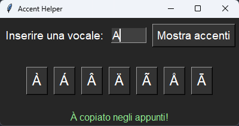

# ✍️ Accent Helper - Guida all'uso

**Premere sulla immaigne sottostante per vedere l'anteprima:**   
[](Graphics/UsageExample.mp4)

## 🚀 Cos'è?
**Accent Helper** è un'applicazione semplice e intuitiva che consente di generare rapidamente tutte le versioni accentate di una vocale.  
Basta inserire la vocale desiderata e successivamente con un semplice click copiare la versione con l'accento scelto direttamente negli appunti.  
É ideale per chi lavora con testi in lingue che utilizzano gli accenti, ad esempio l'italiano o il francese, e per chi non possiede una tastiera con layout speciale .

---

## 💻 Come compilare:
 - Installare pyinstaller con ```pip install pyinstaller```
 - **Compilare** con ```pyinstaller --icon=Graphics/Icon.ico --noconsole --onefile AccentHelper.py```